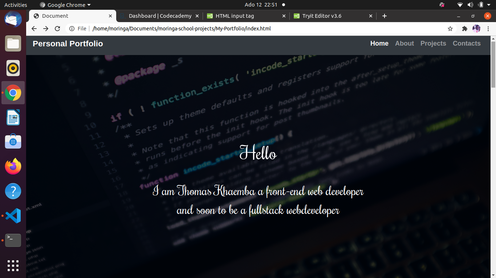

# Personal Portfolio
This website entails all my profile information ,the projects  i  have done  my contacts and social media through which people can reach me and work together either as collaborator or service  provider or share ideas and impact in our society. Here is the [link](https://tomito26.github.io/my-portfolio/) to the website.


## Author
* Thomas Khaemba
## How To Access It
You can access it by cloning  the [repo](https://github.com/tomito26/my-portfolio.git) and following the iinstructions below
```
$ git clone link
$ cd-directory-name
$ code .

```
## How To Contribute
You can contribute by forking the project and then cloning it into your local machine by following the above steps

## Known Bugs
The only challenge is that the website can only be accessed on the  laptop or desktop

## Technologies Used
* HTML
* CSS
* Bootstrap

## Support and Contact Details
 If you ran into any challenge feel free to email me 
 tommybwah@gmail.com
 ## License and Copyright
 Licensed under [MIT license](LICENSE)
